# IM

IM is the chat flow of application.

Mockup of IM screen colorized by individual components:

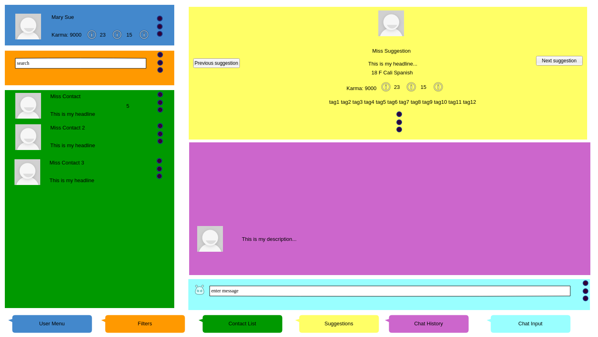

## Table of contents

1. [User menu](#user-menu)

2. [Filters](#filters)

3. [Contact List](#contact-list)

4. [Suggestions](#suggestions)

5. [Chat History](#chat-history)

6. [Chat Input](#chat-input)

## User menu

Component for the logged in User profile and settings.

Mockup of user menu component:

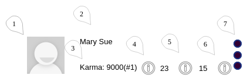

1. Avatar

2. Name

3. Karma and Karma Rank(see [Karma](../gamification/requirements.md#karma))

    * Displays how much Karma this User has and their Karma Rank- clicking opens popup with karma stats and a link to the Karma help page.

4. Trophies(see [Trophies](../gamification/requirements.md#trophies))

    *  Icon followed by the number of Trophies this User has- clicking opens popup with trophies stats and a linking to the Trophies help page

5. Badges(see [Badges](../gamification/requirements.md#badges))

    * Icon followed by the number of Badges this User has- clicking opens popup with trophies stats and a linking to the Badges help page

6. Reactions(see [Reactions](../gamification/requirements.md#reactions)) to this User

    * Icon followed by the number of Reactions this User has- clicking opens popup with trophies stats and a linking to the Reactions help page

7. Options

    Drop down menu mockup:

    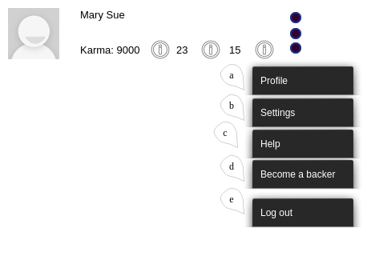

    a) Link to the Profile page

    b) Link to the Settings page

    c) Link to the Help page

    d) Link to the Backer help page

    e) [Logout](../user/requirements.md#logout) 

## Filters

This component act only on the [Contact List](#contact-list), not side wide.

Mockup of filters component:

1.  Search box

2.  Options

    Drop down menu mockup:

    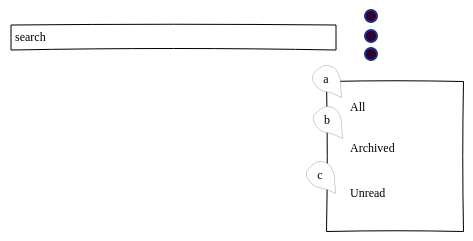

    a) Display all contacts

    b) Display only contacts with [archived chats](#contact-list)

    c) Display only contacts with unread messages

## Contact List

This component shows all Users previously chatted with.

* Contacts are ordered by unread, date

* Archived contacts are not displayed unless the relevant [filter](#filters) option is chosen

* Chats with new unread messages rise to the top and display notifications

* Chat notifications are not displayed for muted contacts, nor they are [suggested](#suggestions) for chatting

* Infinite scrolling for pagination

Mockup of contact list component:

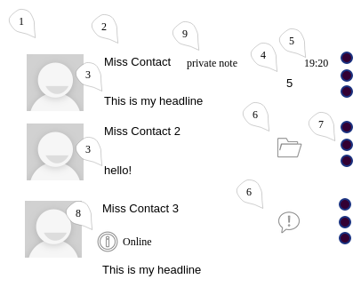

1. Contact avatar

2. Contact name

3. Contact headline or last message message sent(see [Settings](../user/requirements.md#update-settings))

4. Number of unread messages(if contact is not muted)

5. [Message date](#chat-history)

6. Icon if contact is archived or muted

7.  Contact options

    Drop down menu mockup:

    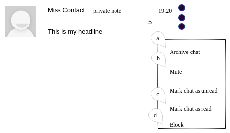

    a) Archive this chat

    b) Mute or unmute this contact

    c) Mark this chat as read or unread

    d) Block this contact

8. Online status(see [User](../user/requirements.md#user-information))

9. Private notes left for this contact(see [User](../user/requirements.md#user-information))

## Suggestions

A suggestion is a new(or from the contact list) User picked by the application for the current User to chat with. 

* Users can skip ahead suggestions and also see the previous ones again

* Muted or ignored Users do not appear as suggestions anymore

* Suggestion algorithm for new Users:

    TBD

* Suggestion algorithm for Users already in the contact list:

    TBD

Contact list suggestion mockup:

* Appears as a dialogue on the contact list entry

a) Ignore this suggestion and jump to next suggestion

b) Chat with this contact

Suggestion component mockup:

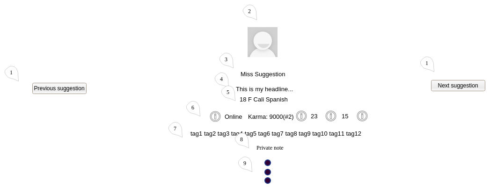

* When an User first sends a messages to a suggestion, or clicks on the contact list to chat up a contact, this component shrinks: 

1. Skip to previous and next suggestions

2. Suggestion avatar

3. Suggestion name

4. Suggestion headline

5. Suggestion age, gender, country, langagues

6. Suggestion online status(see [User](../user/requirements.md)), Karma and Karma Rank(see [Karma](../gamification/requirements.md#karma)), trophies(see [Trophies](../gamification/requirements.md#trophies)), badges(see [Badges](../gamification/requirements.md#badges)) and reactions(see [Reactions](../gamification/requirements.md#reactions))

7. Suggestion list of tags

8. privates notes for this suggestion 

9.  Options

    Drop down menu mockup:

    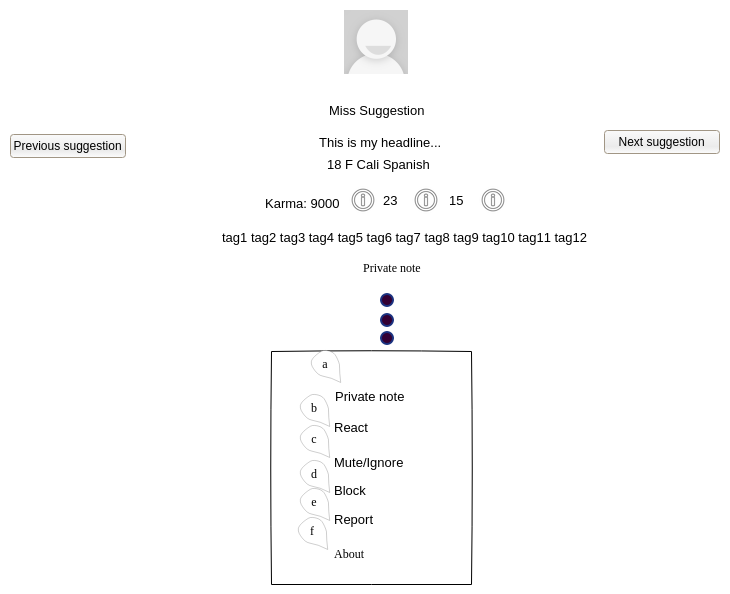

    a) Edit private notes

    b) React to this User(see [Reactions](../gamification/requirements.md#reactions))

    c) Mute/Unmute for contacts, ignore for suggestions

    d) Block this User(see [User](../user/requirements.md#user-information))

    e) Report this User(TBD)

    f) Visible only when the component is shrunk. Displays more information about this user(their description and TBD)

## Chat History

Chat history is the collections of messages between Users on a given chat. A message is each individual entry in a chat history. Messages have the following properties:

* Content

    * Text(markdown able), image or audio

* Message Date

    * Datetime(in the format of elapsed time,e.g., 10 minutes ago, yesterday etc) of when the message was sent

* Message status

    * Sent(server received message), delivered(message sent to User), read(messaged visualized by User)

* Reactions(se [Reactions](../gamification/requirements.md#reactions))

Mockup of chat history component:

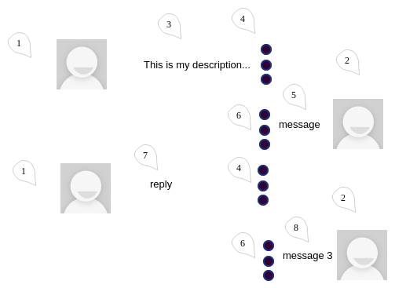

* The User being chatted with's description acts as the first message ever in a chat history

* Chat flows downward, i.e. last message is at the bottom

* Infinite scroll(upwards) for pagination

1. User being chatted with's avatar

2. Logged in User's avatar

3. Fist message

4. Options for incoming messages

Drop down menu mockup:

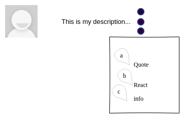

a) Quote this message(markdown syntax)

b) React to this message(see [Reactions](../gamification/requirements.md#reactions))

c) See message date and message status

5. Second Message

6.  Options for outgoing messages 

    Mockup for drop down menu:

    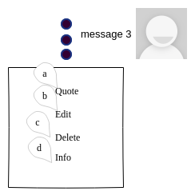

    a) Quote this message(markdown syntax)

    b) Edit this message

    c) Delete this message

    d) See message date and message status

## Chat Input

Component to enter [messages](#chat-history), and display Typing Status(notification about chat partner being currently typing).

Mockup of chat input component:

1. Emojis [#1](https://github.com/azafeh/melanchat/issues/1)

2. Text input

    * Markdown able [#2](https://github.com/azafeh/melanchat/issues/2) [#4](https://github.com/azafeh/melanchat/issues/4) 
    
    * Image/video able(both inline markdown and drag drop) [#4](https://github.com/azafeh/melanchat/issues/5)

3.  Chat input options

    Drop down menu mockup:

    

    a) Whether to send messages with enter or pressing a button [#3](https://github.com/azafeh/melanchat/issues/3)
 
    b) Image/video upload 

    c) Upload an audio message

    d) Upload a video message

    e) Request an audio chat

    f) Request a video chat

4. Typing Status