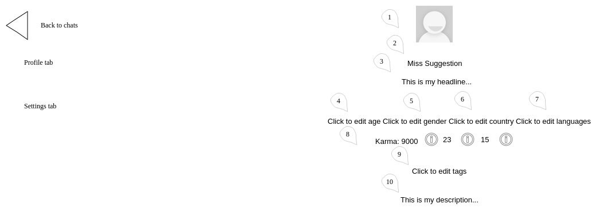
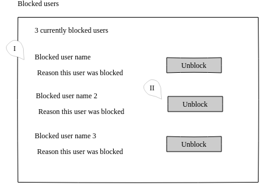

# User

User is an individual account on the application.

# Table of contents

1. [User Information](#user-information)

2. [User Creation](#user-creation)

3. [Login](#login)

4. [Logout](#logout)

5. [Recover Password](#recover-password)

6. [Update Profile](#update-profile)

7. [Update Settings](#update-settings)

## User Information

The following data about an User is visible to other Users on the application:

* Avatar

* Name

* Headline

    * Tagline to draw attention

* Description

    * Bio/about

* Age

    * Calculated from birthday

* Tags

    * A list of free text items indicating interests/hobbies/topics/etc

* Gender

    * M/F/O

* Country

* Karma

    * See [Karma](../gamification/requirements.md#karma)

* Trophies

    * See [Trophies](../gamification/requirements.md#trophies)

* Badges

    * See [Badges](../gamification/requirements.md#badges)

* Languages

    * A list of languages this User can speak

* Online status

    * Online, Away(not active for 10 minutes), Last seen _time since last login_(for logged out Users)

Conversely, the following information is private:

* Email

* Password

    * Saved encrypted in the database

* Visibility status

    * Who can chat with this User: Everyone, Everyone but [Temporary Users](#user-creation), Only contact list, No one

* Reactions

    * See [Reactions](../gamification/requirements.md#reactions)

* Private notes

    * User can tag other Users to help identifying them or remembering something

* Block reason

    * User can supply information while blocking another User to help identifying them or remembering something

## User Creation

Besides the usual account sign up found in most websites, users may be registered as throwaways for purposes of testing the app- such users are called Temporary Users in this document. Temporary Users do not require entering any information to sign up- but expire after logout (be it by manually logging out or end of browser session) or 3 days, and cannot edit their profile. Temporary Users can be made permanent at any time by updating their setting with the necessary [information](#update-settings).

Mockup of landing page with call to action for registering a new account ([#3](https://github.com/easafe/melanchat/issues/3)):

* This page is only available to non logged in Users

* Logged in Users are redirected to /im

1.  Email

    * Must be unique

2.  Password

    * No restrictions besides non blank are applied

3. (Regular) User creation ([#5](https://github.com/easafe/melanchat/issues/5))

    a) User is created with auto generated values for Avatar, Name, Headline and Description

    b) Browser is redirected to /im

    c) User taken through a tutorial(TBD)

4. Temporary User creation

    a) User is created with auto generated values for Avatar, Name, Headline and Description

    b) Browser is redirected to /im

    c) User taken through a tutorial and warned when the account expires

## Login

Login works as traditional by supplying account details. Third party login strategies(i.e., Facebook or Google) are out of scope.

Mockup of login page ([#4](https://github.com/easafe/melanchat/issues/4)):

* This page is only available to non logged in Users

* Logged in Users are redirected to /im

* Non logged in Users are redirected to this page when trying to access the following pages: /im, /settings

* User keeps logged in until they log out, i.e., session does not expire

1. Email

    * Must be previously registered

2. Password

3. User logs in and is redirected:

    * To the page they tried to access which requires to be logged in or IM page otherwise

## Logout

Users can manually end their session at any time.

* A regular logged in User is redirected to the landing page after logging out

* A temporary logged in User is forever deleted from the application after logging out

## Recover Password

Users can request to reset their password in the occasion it is lost. Password reseting is done via email, by supplying a secret link- the application never emails existing passwords.

Mockup of recover password page:

* This page is only available to non logged in Users

* Logged in Users are redirected to /im

1. Email

    * Must be previously registered

2. A reset link will be sent to the email

    * The reset link expires after 1 days

    * The reset link is invalid if already used

3. The reset links leads to

    

    * This page is only available to non logged in Users

    * Logged in Users are redirected to /im

    a) Password and password confirmation must match; no other restrictions are applied

    b) After password reset, User receives an email saying their password was reset

## Update Profile

User can update their information visible to other Users here.

Mockup of profile edition page:

* For Temporary Users inputs are disable and there is a link to Settings' user registration

* User clicks on fields to toggle edition

* Edition is in instant(i.e., fields are changed as edited, no "save" button)

1. Avatar

    * Autogenerated if unset

2. Name

    * Autogenerated if left blank

3. Headline

    * Autogenerated if left blank

4. Age

5. Gender

6. Country

7. Languages

8. This line is not editable

9. List of tags

10. Description

    * Autogenerated if left blank

## Update Settings

User can update their private information here.

Mockup of settings page:

* For Temporary Users display a [register form](#user-creation) instead

1. Basic account settings

    a) Update email

    b) Update password

    c) Delete all data associated with this User, including chats

2.  Chat related settings

    a) [Update visibility](#user-information)

    b) Update [online status](#user-information); unchecked by default

    c) Update typing status(see [IM](../im/requirements.md#chat-input)); unchecked by default

    d) Update message status(see [IM](../im/requirements.md#chat-history)); unchecked by default

    e) Display last message for each User in the contact list(see [IM](../im/requirements.md#contact-list)); unchecked by default, meaning headlines are displayed instead

    f) Update message date(see [IM](../im/requirements.md#chat-history)); unchecked by default

3. TBD

4.  Blocked users management

    a) Number of users currently blocked

    b) Displays list of blocked users

    

    I. Name and reason why this User was [blocked](#user-information)

    II. Unblock this user
